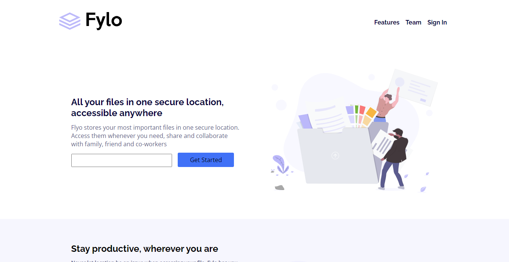

This is a solution to the [Fylo landing page with two column layout challenge on Frontend Mentor](https://www.frontendmentor.io/challenges/fylo-landing-page-with-two-column-layout-5ca5ef041e82137ec91a50f5). Frontend Mentor challenges help you improve your coding skills by building realistic projects.

## Table of contents

- [Overview](#overview)
  - [The challenge](#the-challenge)
  - [Screenshot](#screenshot)
  - [Links](#links)
- [My process](#my-process)
  - [Built with](#built-with)
  - [What I learned](#what-i-learned)
  - [Continued development](#continued-development)
  - [Useful resources](#useful-resources)
- [Author](#author)
- [Acknowledgments](#acknowledgments)

## Overview

### The challenge

Users should be able to:

- View the optimal layout for the site depending on their device's screen size
- See hover states for all interactive elements on the page

### Screenshot

### Links

- Solution URL: [Add solution URL here](https://your-solution-url.com)
- Live Site URL: [Add live site URL here](https://your-live-site-url.com)

## My process

### Built with

- Semantic HTML5 markup
- CSS custom properties
- Flexbox
- CSS Grid

### What I learned

I learned how to combine flex-box and grid in the same website, how to style the validation message of a form and how to effectively mak research in order to have optimum result.

### Continued development

I am still learning how to work with SVGs, so there isn't any in this project. I will come back to edit it when I am done practicing.

- Website - [Emeghiebo Chizoba](https://www.your-site.com)
- Frontend Mentor - [@chizoba-009](https://www.frontendmentor.io/profile/chizoba-009)
- Twitter - [@EmeghieboC](https://www.twitter.com/EmeghieboC)
